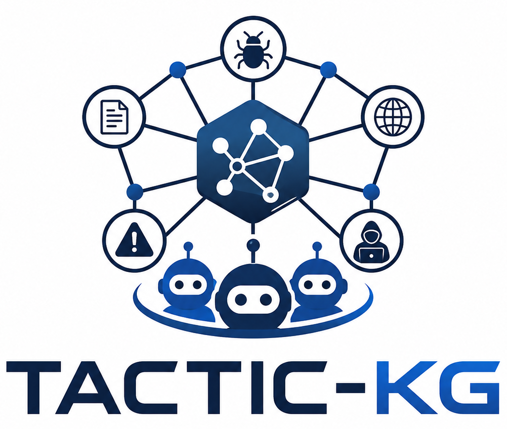
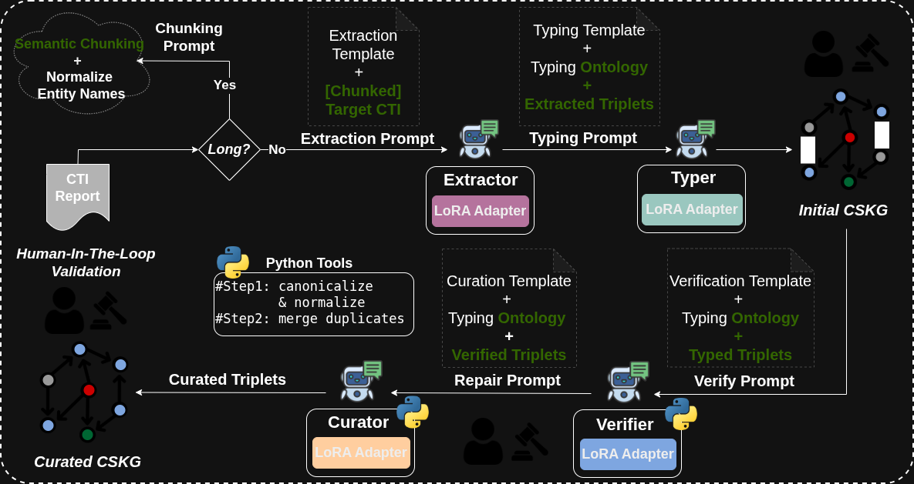

<p align="center">
  
</p>

<h1 align="center">Toward Small Agent Teams for Cyber Threat Intelligence Knowledge Graph Construction</h1>


TACTIC-KG is a modular, agentic pipeline for constructing **Cyber Security Knowledge Graphs (CSKG)** from unstructured reports. It emphasizes **faithfulness, auditability, and controlled reasoning**.

---

## Overview

The system transforms raw CTI reports into a **Curated Cyber Security Knowledge Graph (CSKG)** through a sequence of specialized agents:


Raw Report → Semantic Chunking → Chunked Reports →
Extractor → Typer → Initial CSKG →
Verifier → Curator → Curated CSKG


## 🔥 News

- **June 2026** — 🎉 TACTIC-KG accepted at ESORICS 2026.
- **June 2026** — 🚀 Initial public release.
- **July 2026** — 📄 Preprint available on arXiv.
- **September 2026** — 📍 TACTIC-KG will be presented in Rome, Italy (14–18 September 2026).


---

## Pipeline Description

<p align="center">
  
</p>

A long CTI report is first segmented using **semantic chunking** to preserve discourse boundaries and avoid context fragmentation.

The pipeline executes a sequence of agents under an **auditable and Human-in-the-Loop (HITL)-friendly protocol**:

- All intermediate outputs are serialized in **JSON format**
- The system supports **partial re-execution** for efficient debugging and iteration

---

## 🤖 Agents

### 1. Extractor Agent
- **Input:** Chunked report $R_i$
- **Output:** Candidate relational triples $(h, r, t)$
- **Properties:**
  - Fully grounded in text
  - No typing or global reasoning
  - High recall, potentially noisy

---

### 2. Typer Agent
- **Input:** Extracted triples
- **Output:** Typed triples $(h, r, t, \tau_h, \tau_t)$
- **Properties:**
  - Assigns ontology-compliant entity types
  - Uses local context and relation semantics
  - Does not alter extracted spans

---

### 3. Verifier Agent
- **Input:** Typed triples
- **Output:** Filtered and validated triples
- **Properties:**
  - Triplet-level validation
  - Removes:
    - Unsupported facts
    - Low-confidence relations
    - Ontology violations
  - Improves precision

---

### 4. Curator Agent
- **Input:** Verified triples (merged across chunks)
- **Output:** Final curated CSKG
- **Properties:**
  - Document-level reasoning
  - Adds only **logically necessary structural edges**
  - Examples:
    - Alias resolution (`"TrickBot malware"` ↔ `"TrickBot"`)
    - Normalization links
  - No speculative inference

---

## Key Features

- ✅ Faithfulness-first design
- ✅ Modular multi-agent architecture
- ✅ Ontology-aware reasoning
- ✅ Auditable intermediate outputs
- ✅ Human-in-the-loop compatibility
- ✅ Partial pipeline re-execution

---

## Data Format

All stages communicate using structured JSON:

```json
{
  "id": 0,
  "text": "...",
  "triplets": [
    {
      "subject": "...",
      "relation": "...",
      "object": "...",
      "subject_type": "...",
      "object_type": "..."
    }
  ]
}
```

## How To Use? 

To build the LoRA adapter for a specific agent, run:

```bash
python src/fine_tunning/fine_tune_{agent_name}.py 
```

The base model name, dataset split, and other hyperparameters are defined at the beginning of each script and can be modified directly there.

##  Running Experiments

Experiments are controlled via configuration files located in:

```bash
configs/<model>.yaml
```

To launch an experiment:

```bash
bash run_pipeline.sh
```
Or manually:
```python
python src/load_ft_models/load_ft_{agent_name}.py --config configs/<model>.yaml
python src/utils/evaluate_semantic.py --config configs/<model>.yaml
```

### Execution Workflow

A typical run follows these steps:

Select a configuration file →
Defines models, thresholds, and experiment settings →
Load fine-tuned LoRA agents and run the pipline


### Batch Execution

To run multiple models use:

```bash
bash run_loop_over_models.sh
```


### Reproducing Paper Results

To reproduce the results reported in the paper:

1. Use the provided configuration files in configs/
2. Ensure the correct LoRA checkpoints are available
3. Enable: LoRA-based agents, Hybrid reasoning mode (if specified)
4. Run the pipline for each base model on, TEST0, TEST1 and TEST2 


##  Interactive App

An interactive application is currently under development.

In the meantime, you can run the current prototype interface using Streamlit:

```bash
streamlit run src/app.py
```


## 📖  Paper

If you find **TACTIC-KG** useful in your research, please consider citing our paper:


```bibtex
@misc{bouchiha2026tactickgsmallagentteams,
  title={TACTIC-KG: Toward Small Agent Teams for Cyber Threat Intelligence Knowledge Graph Construction},
  author={Mouhamed Amine Bouchiha and Gregory Blanc},
  year={2026},
  eprint={2607.05001},
  archivePrefix={arXiv},
  primaryClass={cs.CR},
  url={https://arxiv.org/abs/2607.05001}
}
```

📄 **Paper:** https://arxiv.org/abs/2607.05001

📑 **PDF:** https://arxiv.org/pdf/2607.05001