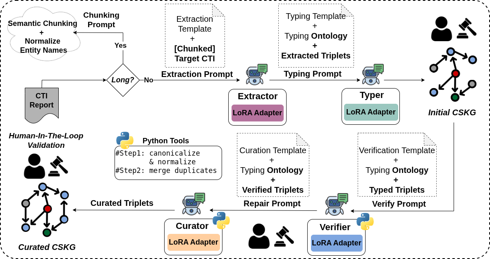

<p align="center">
  
</p>

<h1 align="center">Toward Small Agent Teams for Cyber Threat Intelligence Knowledge Graph Construction</h1>

<div align="center">

<p align="center">
  <a href="https://github.com/mohaminemed/TACTIC-KG">
    
  </a>
  &nbsp;
  <a href="https://arxiv.org/pdf/2607.05001">
    
  </a>
  &nbsp;
  <a href="https://mohaminemed.github.io/TACTIC-KG/">
    
  </a>
</p>

</div>

TACTIC-KG is a modular, cost-effective, agentic pipeline for constructing **Cyber Security Knowledge Graphs (CSKG)** from unstructured reports by decomposing the task into specialized roles for lightweight LLMs. It emphasizes **faithfulness, auditability, and controlled reasoning**.


---

## Overview

The system transforms raw CTI reports into a **Curated CSKG** through a sequence of specialized agents:


Raw Report → Semantic Chunking → Chunked Reports →
Extractor → Typer → Initial CSKG →
Verifier → Curator → Curated CSKG


## 🔥 News

- **June 2026** — 🎉 TACTIC-KG accepted at ESORICS 2026.
- **June 2026** — 🚀 Initial public release.
- **July 2026** — 📄 Preprint available on arXiv.
- **September 2026** — 📍 TACTIC-KG will be presented in Rome, Italy (14–18 September 2026).


---

## Pipeline Description

<p align="center">
  
</p>

A long CTI report is first segmented using **semantic chunking** to preserve discourse boundaries and avoid context fragmentation.

The pipeline executes a sequence of agents under an **auditable and Human-in-the-Loop (HITL)-friendly protocol**:

- All intermediate outputs are serialized in **JSON format**
- The system supports **partial re-execution** for efficient debugging and iteration

---

## 🤖 Agents

### 1. Extractor Agent
- **Input:** Chunked report 
- **Output:** Candidate relational triples
- **Properties:**
  - Fully grounded in text
  - No typing or global reasoning
  - High recall, potentially noisy

---

### 2. Typer Agent
- **Input:** Extracted triples
- **Output:** Typed triples 
- **Properties:**
  - Assigns ontology-compliant entity types
  - Uses local context and relation semantics
  - Does not alter extracted spans

---

### 3. Verifier Agent
- **Input:** Typed triples
- **Output:** Filtered and validated triples
- **Properties:**
  - Triplet-level validation
  - Removes:
    - Unsupported facts
    - Low-confidence relations
    - Ontology violations
  - Improves precision

---

### 4. Curator Agent
- **Input:** Verified triples (merged across chunks)
- **Output:** Final curated CSKG
- **Properties:**
  - Document-level reasoning
  - Adds only **logically necessary structural edges**
  - Examples:
    - Alias resolution (`"TrickBot malware"` ↔ `"TrickBot"`)
    - Normalization links
  - No speculative inference

---

## Key Features

- ✅ Faithfulness-first design
- ✅ Modular multi-agent architecture
- ✅ Ontology-aware reasoning
- ✅ Auditable intermediate outputs
- ✅ Human-in-the-loop compatibility
- ✅ Partial pipeline re-execution

---

## 📖  Paper

If you find **TACTIC-KG** useful in your research, please consider citing our paper:


```bibtex
@inproceedings{bouchiha2026tactic,
  title={TACTIC-KG: Toward Small Agent Teams for Cyber Threat Intelligence Knowledge Graph Construction},
  author={Bouchiha, Mouhamed Amine and Blanc, Gregory},
  booktitle={31st European Symposium on Research in Computer Security (ESORICS)},
  year={2026}
}
```
